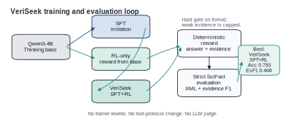
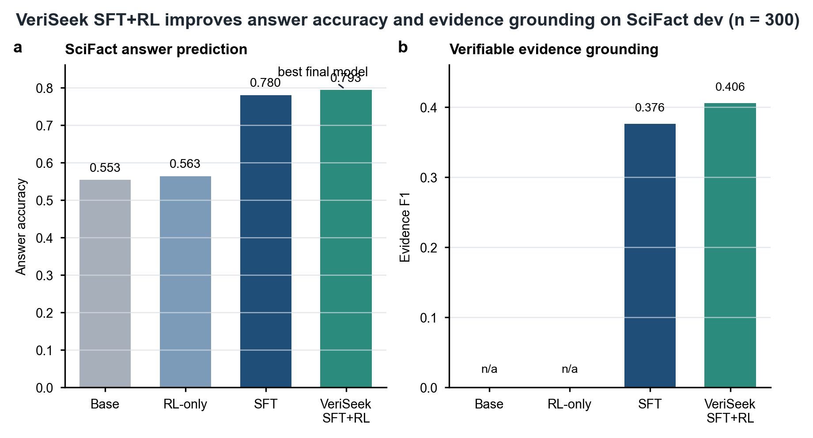

# VeriSeek: Evidence-Seeking Scientific QA With Qwen3-4B

[中文说明](README_CN.md)

VeriSeek is a compact, reproducible project for training scientific QA models to answer with auditable evidence. The public/default base model is:

```text
Qwen/Qwen3-4B-Thinking-2507
```

The local default path is:

```text
models/Qwen3-4B-Thinking-2507
```

Starting from the same compact reasoning model, VeriSeek asks whether scientific evidence grounding is better learned by supervised imitation, evidence-aware reward optimization, or a two-stage SFT+RL pipeline.

## Method



VeriSeek keeps the training stack small on purpose:

- no trainer rewrite;
- no rollout redesign;
- no search/visit protocol changes;
- no PDF, figure, table, or multimodal parsing;
- no embedding similarity reward;
- no LLM-as-a-judge reward.

The model is trained and evaluated through a deterministic answer/evidence protocol:

```text
<answer>
SUPPORTS / REFUTES / NOT_ENOUGH_INFO
</answer>

<evidence>
[1] evidence sentence
</evidence>
```

## Main Result

On SciFact dev (`n = 300`), the final public model, **VeriSeek SFT+RL**, gives the strongest answer accuracy and evidence grounding among the four training paths.



| Model | Training Path | SciFact Answer Acc | SciFact Evidence F1 | Evaluation Note |
|---|---|---:|---:|---|
| Qwen3-4B Base | none | 0.553 | n/a | prefix-constrained label diagnostic |
| VeriSeek RL-only | RL-only | 0.563 | n/a | prefix-constrained label diagnostic |
| VeriSeek SFT | SFT | 0.780 | 0.376 | strict XML evidence evaluation |
| VeriSeek SFT+RL | SFT+RL | **0.793** | **0.406** | strict XML evidence evaluation |

Compared with the SFT baseline:

```text
SciFact Answer Acc: +0.013
SciFact Evidence F1: +0.029
Unsupported Rate: -0.053
```

Base and RL-only are included as label-space controls. They do not reliably follow the VeriSeek XML evidence protocol, so their evidence F1 is not reported as a comparable strict grounding score.

## Training Paths

VeriSeek compares four conditions from the same base model:

- `Qwen3-4B Base`: untrained base model evaluation when possible.
- `VeriSeek RL-only`: evidence-aware RL directly from `Qwen/Qwen3-4B-Thinking-2507`.
- `VeriSeek SFT`: supervised fine-tuning from `Qwen/Qwen3-4B-Thinking-2507`.
- `VeriSeek SFT+RL`: evidence-aware RL initialized from the VeriSeek SFT checkpoint.

SFT teaches the model the output protocol and task behavior. RL-only tests whether evidence reward alone can induce the behavior. SFT+RL tests whether imitation followed by reward optimization gives the best trade-off.

## Reward Design

The final SciFact reward is deterministic and evidence-aware:

```text
if format is invalid:
    R = 0

if gold is NOT_ENOUGH_INFO:
    R = 0.80 * R_answer + 0.20 * R_empty_or_concise_evidence

if gold is SUPPORTS or REFUTES and prediction is NOT_ENOUGH_INFO:
    R = 0.05

otherwise:
    R = 0.35 * R_answer + 0.55 * R_evidence + 0.10 * R_conciseness
    if R_evidence < 0.20:
        R = min(R, 0.25)
```

The reward uses only label correctness, token-level evidence overlap, output format, and concise evidence. See [docs/reward_design.md](docs/reward_design.md).

## RL Training Pain Points: Cold Start and Reward Sparsity

The RL-only path gave us +0.01 over the base model. When we first saw this number, the natural question was: what went wrong?

### The Signal Problem Beneath the Surface

ArenaRL's work on open-ended agent training pointed us toward a useful concept — **discriminative collapse**. In LLM-as-judge settings, as the policy improves and outputs become more similar, point-wise reward scores compress into a narrow band (0.8–0.9 on a 0–1 scale). The within-group variance shrinks until it is indistinguishable from the judge's own sampling noise. At that point, the reward signal drowns and GRPO's advantage computation has nothing real to work with.

Our RL-only run hit a harder version of the same pattern. Every rollout scored R = 0, exactly. Zero variance across every group, every step. The SNR never had a chance.

### How the Format Gate Created a Flat Landscape

The SciFact reward enforces a hard format gate: invalid format → R = 0 (see [Reward Design](#reward-design)). We kept it this way deliberately — partial credit or distance-based shaping would have introduced their own pathologies, rewarding almost-correct XML that still broke downstream parsing. What we did not fully appreciate at the time was the interaction between this gate and a cold-started policy.

The Qwen3-4B-Thinking base model has never seen `<answer>`/`<evidence>` tags. Its rollouts are coherent chain-of-thought — reasonable text, wrong structure. **Format success rate: 0.0, sustained across the full training run.** Every rollout, every step, R = 0.

### Why GRPO Had Nothing to Work With

GRPO normalizes advantages within each response group: A_i = (R_i - μ_group) / σ_group. ArenaRL's central insight — that relative comparison within a group is more robust than absolute scoring — is the reason this normalization exists. Group-relative advantage is precisely GRPO's answer to noisy or miscalibrated rewards.

But the same mechanism has a dependency it cannot function without: the group needs reward spread. When all N responses in a group score R = 0:

- μ_group = 0, σ_group = 0
- A_i = 0/0 → clamped to 0
- ∇ log π(a|s) · A ≡ 0 for every token

The policy gradient is identically zero. The model drifts on sampling noise alone through the entire training run. No format acquisition, no accuracy improvement, no evidence grounding.

### What Changed With SFT Warmup

SFT gave the model the output protocol before RL touched it. Format success rate jumped to 0.993 from supervised examples alone. Once format was reliable, the reward function actually executed on nearly every rollout — and when it did, evidence quality and answer correctness created real variance across the group:

```text
Format success rate:  0.0  → 0.993  (after SFT)
Unsupported rate:     0.467 → 0.413  (after RL)
Evidence F1:          0.376 → 0.406  (after RL)
```

The RL phase did what it is supposed to: it differentiated better evidence selections from worse ones, and it pushed down unsupported guesses. But none of this was possible until the reward landscape had actual terrain to navigate.

### Looking Back

The RL-only result does not say that GRPO is fragile or that cold start is hard. It says something simpler: the group-relative mechanism that makes GRPO robust to reward noise has a hard floor — zero variance in, zero gradient out. A hard format gate keeps the reward clean, and we would make the same choice again. But it also means the policy needs to reach a minimum viable format success rate before reinforcement can begin, and the cleanest way to get there is supervised imitation.

## Repository Map

```text
data/                         dataset converters for SciFact, QASPER, LitQA2
eval/                         deterministic evaluation scripts and metrics
RL/verl/utils/reward_score/   VeriSeek evidence reward implementation
scripts/train_veriseek_*.sh   SFT, RL-only, and SFT+RL entrypoints
scripts/eval_gated_checkpoints.sh
scripts/plot_veriseek_results.py
docs/                         reward, data, smoke-training, and benchmark notes
assets/                       benchmark figures and source tables
```

## Environment

The successful full run used:

```text
Python 3.11
PyTorch 2.9.1
CUDA 12.8
2 x NVIDIA A800 80GB
```

The 5-step smoke job can run on one GPU. The reproducible VeriSeek SFT+RL run used two A800 GPUs.

## Download The Base Model

```bash
bash scripts/local_prepare_assets.sh
```

This downloads:

```text
Qwen/Qwen3-4B-Thinking-2507 -> models/Qwen3-4B-Thinking-2507
```

## Prepare SciFact Data

Tiny debug split:

```bash
python data/prepare_scifact.py \
  --output_dir data/processed/scifact \
  --max_train 20 \
  --max_dev 5 \
  --max_test 5
```

Full SciFact split:

```bash
python data/prepare_scifact.py \
  --output_dir data/processed/scifact
```

Each row is written as a parquet record compatible with the existing training stack:

```json
{
  "prompt": [{"role": "user", "content": "..."}],
  "reward_model": {"ground_truth": "{\"answer\": \"SUPPORTS\", \"evidence\": [\"...\"]}"},
  "data_source": "scifact_evidence"
}
```

## Run A 5-Step RL Smoke Job

```bash
MODEL_PATH=$PWD/models/Qwen3-4B-Thinking-2507 \
TRAIN_FILE=$PWD/data/processed/scifact/train.parquet \
VAL_FILE=$PWD/data/processed/scifact/dev.parquet \
OUTPUT=$PWD/outputs/veriseek_smoke_qwen3_1gpu \
GPU_NUM=1 \
TENSOR_MODEL_PARALLEL_SIZE=1 \
MAX_STEPS=5 \
TRAIN_BATCH_SIZE=2 \
PPO_MINI_BATCH_SIZE=2 \
AGENT_GRPO_N=1 \
MAX_PROMPT_LEN=1280 \
MAX_RESPONSE_LEN=512 \
MAX_MODEL_LEN=2048 \
bash scripts/train_veriseek_grpo.sh
```

Equivalent wrapper:

```bash
bash scripts/remote_smoke_train.sh
```

## Reproduce VeriSeek SFT+RL

First prepare an SFT checkpoint. The wrapper uses the upstream SFT trainer and requires SFT-compatible data:

```bash
MODEL_PATH=$PWD/models/Qwen3-4B-Thinking-2507 \
TRAIN_FILES=/path/to/sft_train.parquet \
VAL_FILES=/path/to/sft_dev.parquet \
CKPT_DIR=$PWD/outputs/veriseek_sft \
NUM_GPUS=2 \
TRAIN_BATCH_SIZE=2 \
TOTAL_TRAINING_STEPS=400 \
SAVE_FREQ=50 \
bash scripts/train_veriseek_sft.sh
```

Then run evidence-aware SFT+RL from the SFT checkpoint:

```bash
SFT_MODEL_PATH=$PWD/outputs/veriseek_sft_hf \
TRAIN_FILE=$PWD/data/processed/scifact/train.parquet \
VAL_FILE=$PWD/data/processed/scifact/dev.parquet \
OUTPUT=$PWD/outputs/veriseek_sft_rl \
EXPERIMENT_NAME=veriseek_sft_rl \
MAX_STEPS=200 \
SAVE_FREQ=50 \
TRAIN_BATCH_SIZE=2 \
PPO_MINI_BATCH_SIZE=2 \
GPU_NUM=2 \
TENSOR_MODEL_PARALLEL_SIZE=1 \
MAX_PROMPT_LEN=1664 \
MAX_RESPONSE_LEN=512 \
MAX_MODEL_LEN=2560 \
MAX_NUM_BATCHED_TOKENS=4096 \
ROLLOUT_GPU_MEMORY_UTILIZATION=0.55 \
ROLLOUT_MAX_NUM_SEQS=8 \
AGENT_GRPO_N=4 \
bash scripts/train_veriseek_sft_rl.sh
```

The public result is evaluated from:

```text
outputs/veriseek_sft_rl/global_step_200
```

## Evaluate The Public Checkpoint

```bash
RUN_DIR=$PWD/outputs/veriseek_sft_rl \
BENCH_DIR=$PWD/outputs/benchmarks/veriseek_sft_rl \
TMP_PREFIX=$PWD/outputs/tmp_veriseek_sft_rl \
STEPS="200" \
bash scripts/eval_gated_checkpoints.sh
```

This merges the FSDP checkpoint into a temporary Hugging Face directory, generates SciFact dev predictions, computes strict and relaxed metrics, writes component diagnostics, and removes the temporary model directory.

## Recreate The Figures

```bash
python scripts/plot_veriseek_results.py \
  --source assets/veriseek_scifact_benchmark_source.tsv \
  --output_prefix assets/veriseek_scifact_benchmark

python scripts/plot_veriseek_method.py
```

Outputs:

```text
assets/veriseek_scifact_benchmark.png
assets/veriseek_method_overview.svg
assets/veriseek_method_overview.pdf
assets/veriseek_method_overview.png
```

## Evaluate A Prediction File

```bash
python eval/eval_scifact.py \
  --pred_path outputs/scifact_predictions.jsonl \
  --mode both
```

Prediction JSONL records should include `prediction` and either `ground_truth` or `reward_model.ground_truth`.

## Documentation

- [Reward design](docs/reward_design.md)
- [Data format](docs/data_format.md)
- [Reproduction notes](docs/reproduction.md)
- [Smoke training runbook](docs/smoke_training.md)
- [SciFact benchmark report](docs/benchmark_report.md)
