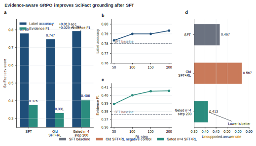

# VeriSeek：基于 Qwen3-4B 的科学问答证据寻址实验

[English README](README.md)

VeriSeek 是一个最小、可复现的科学问答证据 grounding 项目。项目唯一公开/默认 base model 是：

```text
Qwen/Qwen3-4B-Thinking-2507
```

本地默认路径：

```text
models/Qwen3-4B-Thinking-2507
```

核心问题是：从同一个 compact reasoning model 出发，科学证据 grounding 更适合通过监督模仿学到，还是通过 evidence-aware reward optimization 学到，或者需要 SFT+RL 两阶段结合？

## 方法总览


## 主要结果

在 SciFact dev 上，当前最佳 checkpoint 是 gated n=4 SFT+RL 的 `global_step_200`。它同时提升了标签准确率和证据 F1：



| Model | Training Path | SciFact Acc | SciFact Evidence F1 | Format Success | Unsupported Rate |
|---|---|---:|---:|---:|---:|
| VeriSeek-SFT | SFT | 0.780 | 0.376 | 0.993 | 0.467 |
| Old VeriSeek-SFT-RL | SFT+RL, n=1 reward | 0.747 | 0.331 | 0.993 | 0.567 |
| VeriSeek-SFT-RL | gated SFT+RL, n=4, step 50 | 0.783 | 0.389 | 0.993 | 0.437 |
| VeriSeek-SFT-RL | gated SFT+RL, n=4, step 100 | 0.790 | 0.400 | 0.990 | 0.420 |
| VeriSeek-SFT-RL | gated SFT+RL, n=4, step 150 | 0.790 | 0.405 | 0.990 | 0.417 |
| VeriSeek-SFT-RL | gated SFT+RL, n=4, step 200 | **0.793** | **0.406** | 0.990 | **0.413** |

相对 SFT，step-200 gated n=4 checkpoint 的提升是：

```text
SciFact Acc:         +0.013
SciFact Evidence F1: +0.029
Unsupported Rate:    -0.053
```

旧版 SFT+RL 保留为负对照：它的训练 reward 上升了，但模型变得过于保守，更频繁输出 `NOT_ENOUGH_INFO`。最终版本通过 gated reward 和 `AGENT_GRPO_N=4` 修复了这个问题：格式错误直接归零，弱证据答案被封顶，并且每个 prompt 采样 4 个响应来形成真正的 GRPO 组内比较信号。

## 训练路径

VeriSeek 比较四个评估条件：

- `Qwen3-4B Base`：未训练 base model。
- `VeriSeek-SFT`：从 `Qwen/Qwen3-4B-Thinking-2507` 做监督微调。
- `VeriSeek-RL`：直接从 base model 做 evidence-aware RL。
- `VeriSeek-SFT-RL`：先做 VeriSeek-SFT，再从 SFT checkpoint 做 evidence-aware RL。

SFT 用来教会模型输出格式和任务行为。RL-only 用来测试 deterministic evidence reward 是否能单独诱导 evidence-seeking 行为。SFT+RL 用来测试“先模仿、再奖励优化”是否能得到更好的折中。

## 仓库结构

```text
data/                         SciFact、QASPER、LitQA2 数据转换器
eval/                         确定性评估脚本与指标
RL/verl/utils/reward_score/   VeriSeek evidence reward 实现
scripts/train_veriseek_*.sh   SFT、RL-only、SFT+RL 训练入口
scripts/eval_gated_checkpoints.sh
scripts/plot_veriseek_results.py
docs/                         reward、数据、smoke training、benchmark 文档
assets/                       benchmark 图和源数据
```

MVP 不改 trainer internals，不改 rollout，不改 search/visit tool protocol，不加入 PDF/figure/table parsing，不做 multimodal，不用 embedding similarity，也不用 LLM-as-a-judge reward。

## 奖励函数

第一版 reward 是：

```text
R = 0.45 * R_answer
  + 0.35 * R_evidence
  + 0.15 * R_format
  + 0.05 * R_conciseness
```

第一轮 SFT+RL 暴露出保守的 `NOT_ENOUGH_INFO` reward hacking 之后，SciFact 改成 gated deterministic reward：

- 格式错误直接 0 分；
- 对 `SUPPORTS` / `REFUTES`，如果 evidence 很弱，总分封顶；
- 对可回答 claim 预测 `NOT_ENOUGH_INFO` 只能得到很小奖励；
- 对 gold `NOT_ENOUGH_INFO`，奖励正确标签以及空/简洁证据；
- QASPER 保留 answer/evidence/format/conciseness 加权 reward。

详见 [docs/reward_design.md](docs/reward_design.md)。

## 环境

成功的完整实验使用：

```text
Python 3.11
PyTorch 2.9.1
CUDA 12.8
2 x NVIDIA A800 80GB
```

5-step smoke job 可以在 1 张 GPU 上跑。200-step gated n=4 实验使用 2 张 A800。

## 下载 base model

```bash
bash scripts/local_prepare_assets.sh
```

该脚本下载：

```text
Qwen/Qwen3-4B-Thinking-2507 -> models/Qwen3-4B-Thinking-2507
```

## 准备 SciFact 数据

小型 debug split：

```bash
python data/prepare_scifact.py \
  --output_dir data/processed/scifact \
  --max_train 20 \
  --max_dev 5 \
  --max_test 5
```

完整 SciFact split：

```bash
python data/prepare_scifact.py \
  --output_dir data/processed/scifact
```

输出 parquet 行格式兼容当前训练栈：

```json
{
  "prompt": [{"role": "user", "content": "..."}],
  "reward_model": {"ground_truth": "{\"answer\": \"SUPPORTS\", \"evidence\": [\"...\"]}"},
  "data_source": "scifact_evidence"
}
```

## 运行 5-step RL smoke job

```bash
MODEL_PATH=$PWD/models/Qwen3-4B-Thinking-2507 \
TRAIN_FILE=$PWD/data/processed/scifact/train.parquet \
VAL_FILE=$PWD/data/processed/scifact/dev.parquet \
OUTPUT=$PWD/outputs/veriseek_smoke_qwen3_1gpu \
GPU_NUM=1 \
TENSOR_MODEL_PARALLEL_SIZE=1 \
MAX_STEPS=5 \
TRAIN_BATCH_SIZE=2 \
PPO_MINI_BATCH_SIZE=2 \
AGENT_GRPO_N=1 \
MAX_PROMPT_LEN=1280 \
MAX_RESPONSE_LEN=512 \
MAX_MODEL_LEN=2048 \
bash scripts/train_veriseek_grpo.sh
```

等价 wrapper：

```bash
bash scripts/remote_smoke_train.sh
```

## 复现 gated n=4 SFT+RL

先准备 SFT checkpoint。SFT wrapper 使用上游 SFT trainer，需要 SFT-compatible 数据：

```bash
MODEL_PATH=$PWD/models/Qwen3-4B-Thinking-2507 \
TRAIN_FILES=/path/to/sft_train.parquet \
VAL_FILES=/path/to/sft_dev.parquet \
CKPT_DIR=$PWD/outputs/veriseek_sft \
NUM_GPUS=2 \
TRAIN_BATCH_SIZE=2 \
TOTAL_TRAINING_STEPS=400 \
SAVE_FREQ=50 \
bash scripts/train_veriseek_sft.sh
```

然后从 SFT checkpoint 启动 evidence-aware SFT+RL：

```bash
SFT_MODEL_PATH=$PWD/outputs/veriseek_sft_hf \
TRAIN_FILE=$PWD/data/processed/scifact/train.parquet \
VAL_FILE=$PWD/data/processed/scifact/dev.parquet \
OUTPUT=$PWD/outputs/veriseek_sft_rl_gated_n4 \
EXPERIMENT_NAME=veriseek_sft_rl_gated_n4 \
MAX_STEPS=200 \
SAVE_FREQ=50 \
TRAIN_BATCH_SIZE=2 \
PPO_MINI_BATCH_SIZE=2 \
GPU_NUM=2 \
TENSOR_MODEL_PARALLEL_SIZE=1 \
MAX_PROMPT_LEN=1664 \
MAX_RESPONSE_LEN=512 \
MAX_MODEL_LEN=2560 \
MAX_NUM_BATCHED_TOKENS=4096 \
ROLLOUT_GPU_MEMORY_UTILIZATION=0.55 \
ROLLOUT_MAX_NUM_SEQS=8 \
AGENT_GRPO_N=4 \
bash scripts/train_veriseek_sft_rl.sh
```

预期 checkpoint：

```text
outputs/veriseek_sft_rl_gated_n4/global_step_50
outputs/veriseek_sft_rl_gated_n4/global_step_100
outputs/veriseek_sft_rl_gated_n4/global_step_150
outputs/veriseek_sft_rl_gated_n4/global_step_200
```

## 评测 checkpoints

```bash
RUN_DIR=$PWD/outputs/veriseek_sft_rl_gated_n4 \
BENCH_DIR=$PWD/outputs/benchmarks/gated_n4 \
TMP_PREFIX=$PWD/outputs/tmp_gated_n4_step \
STEPS="50 100 150 200" \
bash scripts/eval_gated_checkpoints.sh
```

该脚本会把每个 FSDP checkpoint 临时 merge 成 Hugging Face 模型，生成 SciFact dev 预测，计算 strict/relaxed 指标和 reward component 诊断，并在每个 step 结束后删除临时模型目录。

## 重画结果图

```bash
python scripts/plot_veriseek_results.py \
  --source assets/veriseek_scifact_benchmark_source.tsv \
  --output_prefix assets/veriseek_scifact_benchmark
```

输出：

```text
assets/veriseek_scifact_benchmark.svg
assets/veriseek_scifact_benchmark.pdf
assets/veriseek_scifact_benchmark.png
assets/veriseek_scifact_benchmark.tiff
assets/veriseek_method_overview.svg
assets/veriseek_method_overview.pdf
assets/veriseek_method_overview.png
```

## 评估预测文件

```bash
python eval/eval_scifact.py \
  --pred_path outputs/scifact_predictions.jsonl \
  --mode both
```

预测 JSONL 每行至少包含 `prediction`，并包含 `ground_truth` 或 `reward_model.ground_truth`。

## 文档

- [Reward design](docs/reward_design.md)
- [Data format](docs/data_format.md)
- [Reproduction notes](docs/reproduction.md)
- [Smoke training runbook](docs/smoke_training.md)
- [SciFact benchmark report](docs/benchmark_report.md)
